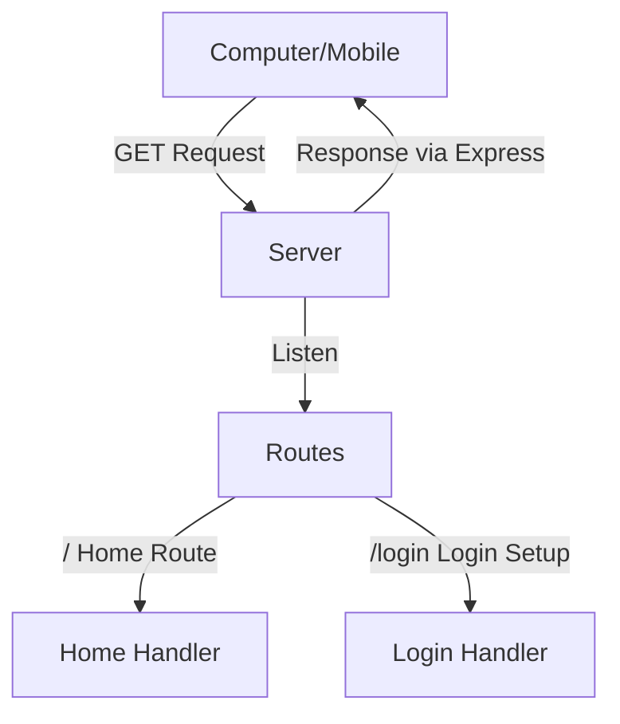

# NODE.JS BACKEND
1.) a web and mobile-based application that interacts with a backend system and a remote database.
```node.js
+---------+       +---------+       +---------+       +----------------+
| Browser | <--> |  API    | <-->   | Backend | <-->  |     DB         |
+---------+       +---------+       +---------+       | Another        |
                                                      | Continent      |
+---------+       +---------+       +---------+       +----------------+
| Mobile  | <--> |  API    | <-->   | Backend | <-->  |     DB         |
+---------+       +---------+       +---------+       | Another        |
                                                      | Continent      |
                                                      +----------------+
```

## setting up your Node.js backend
1. Install Node.js and npm
2. Create a Project Directory
3.  initialize a Node.js project
   
 ```node.js
        npm init
 ```
4. Install Dependencies
- for example:- 
```node.js
npm install express
```

